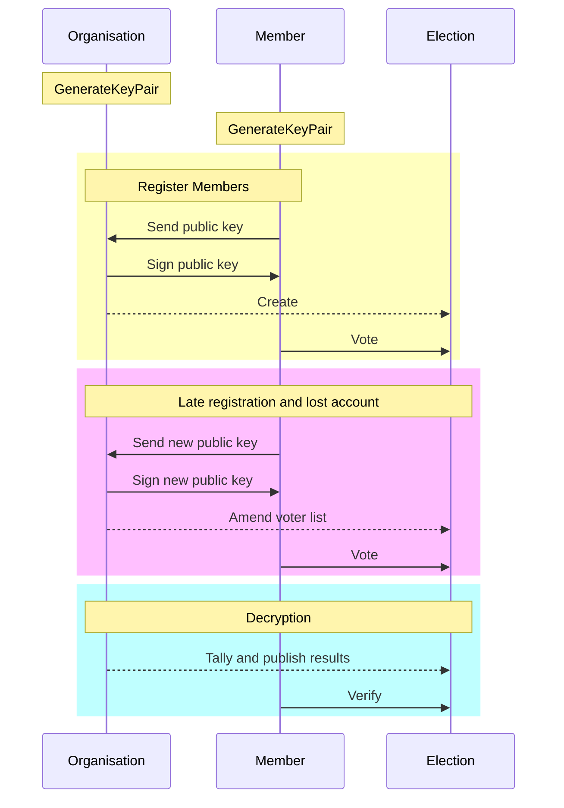
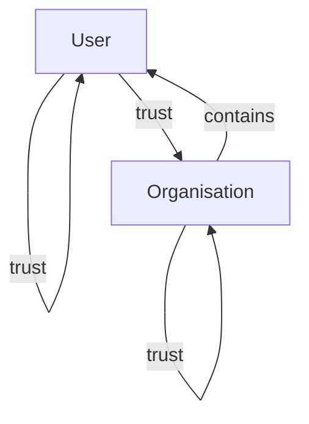

### Disclamer

Organisations is an experimental, planned future feature.

For now, election administrators directly manage the list of users of every elections individually.

### What

It's the idea of managing a set of users, defined by public keys, in a decentralized fashion.

Unlike DAOs, there is one or more accounts that control the organisations. We call them **administrators**.

Why do we say that this process is still decentralized ? Because:
- There is many organisations (Everyone can start his own)
- There could be many organisation admins that have to agree (multi-sig) to add/remove someone
- The process of managing the member list is fully transparent, open for anyone to audit and verify.

In practice organisations can organize key-signing **ceremonies** to associate a real-word identity (name, virtual or physical address), attributes (age, city, etc) or anything, to a specific public key.

### How

Administrators add (or trust) members.

The trust action is defined as a digital signature (like PGP web-of-trust)

When necessary, admins can remove members.

### Why

### An official Scrutin.app organisation 

We provide an official organisation that acts as a bridge between Scrutin accounts and classical authentication methods (email and phone numbers).

If technically possible, the organisation should not leak who is or isn't using the service.

### Beyond organisations

A web-of-trust with two kinds of nodes:
- Users
- Organisations

Edges are digital signatures.

Organisation can add (trust) members.

But users can also start to trust organsations.

And organisations can trust each others if they wish.

Making a rich graph of signatures representing trust

This project may work hand-in-hand with scrutin.
