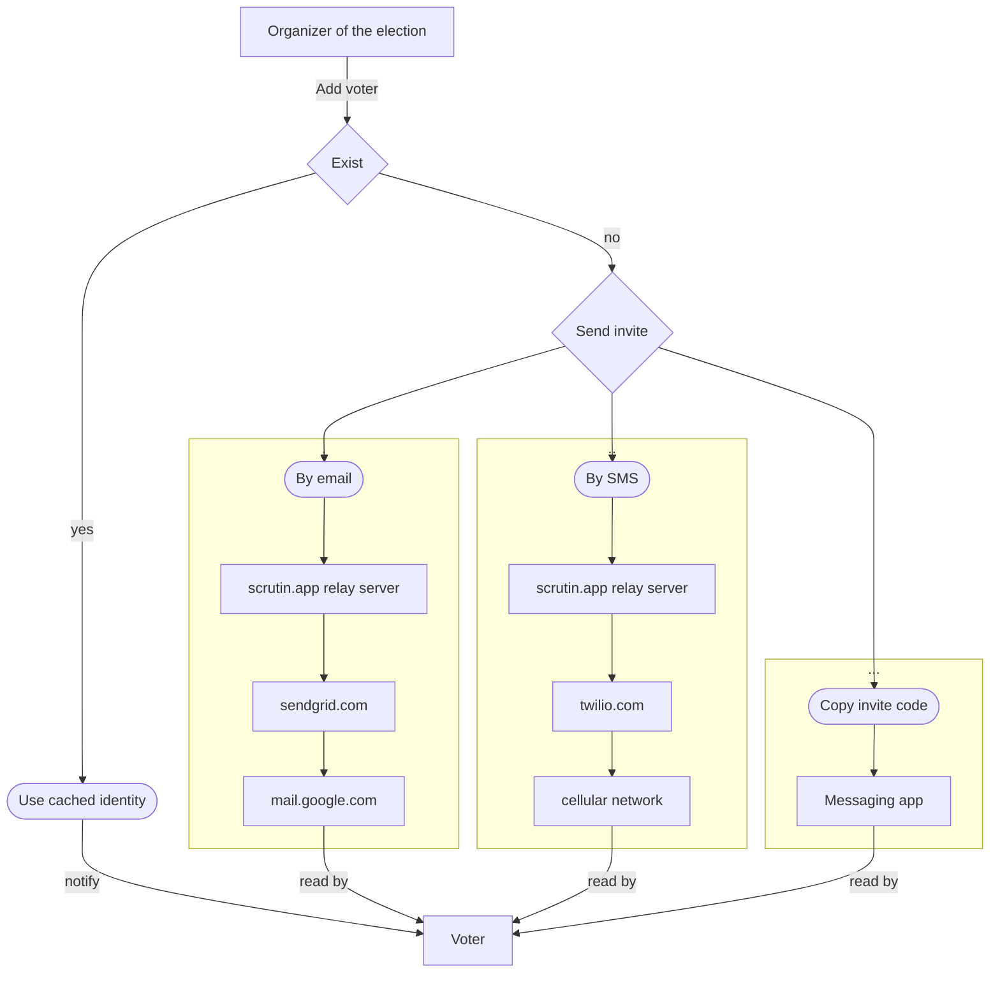
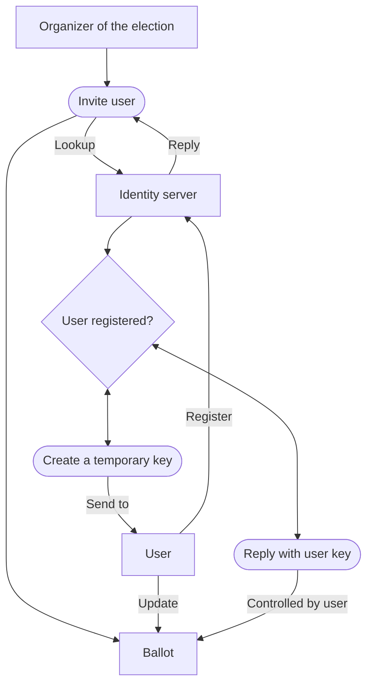

In verifiable elections, the voting list is publicly available.
We identify voters using cryptography (digital signatures)

In our first approach, the organizer of the election generate the credentials and send them to voters.
The voter informations are not stored anywhere, thus cannot leak.

If he wants, he can maintain a local database of user identities to only send credentials once.

##### First approach: Local database

##### Problem 1: Secrecy of voters' secret keys 

Here secret keys are generated on the organizer device, then sent to voters, sometimes through many intermediates.
We would prefer generating the secret keys on the voter's device and never move them.

##### Problem 2: Staying up-to-date (cache invalidation)

The problem with maintaining a local database of contacts identities is that it cannot be remotly edited.
Users will loose their secrets. Some secrets will be stolen.
We need mechanisms to deal with this.

##### Second approach: Using an identity server

We solved both problems:
- Keys are generated on the user's device and never leave
- If the user loose his secret key, he can now inform the identity server and upload a new key
