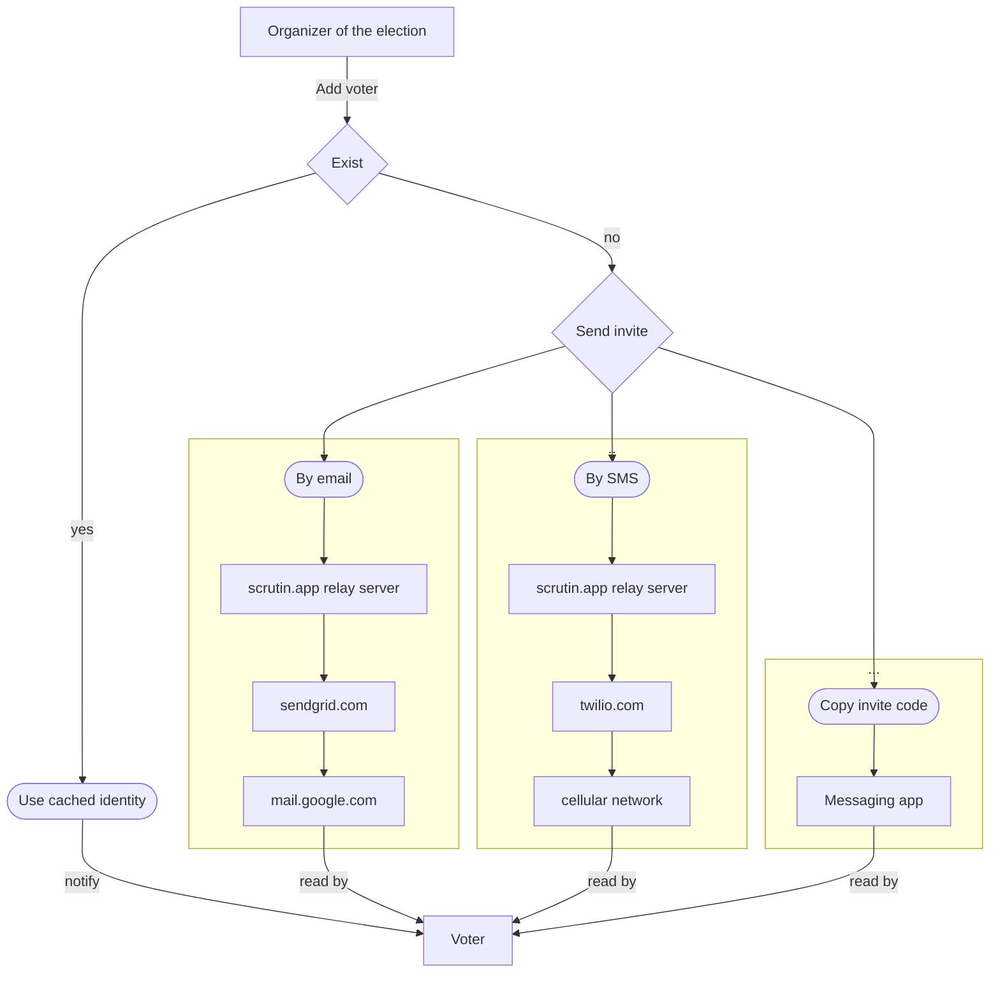

In our first approach, the organizer of the election generate the credentials and send them to voters.
The voter informations are not stored anywhere, thus cannot leak.

If he wants, he can maintain a local database of user identities to only send credentials once.

