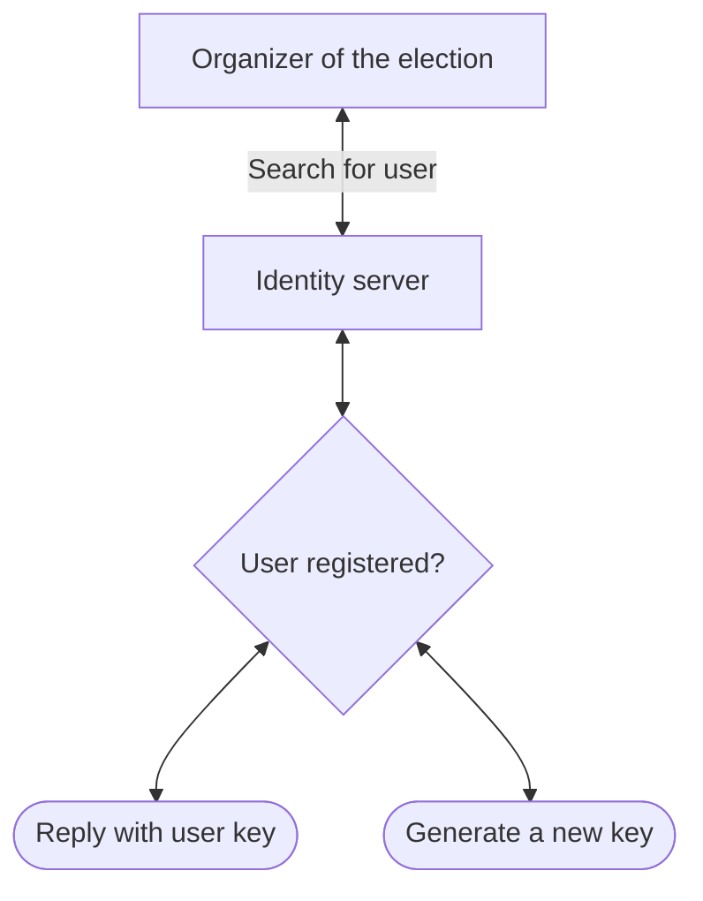

In [Belenios](https://www.belenios.org/):

- Votes are **encrypted** using the election's key.
- Voters **authenticate** their vote using digital signatures.
- The voting list is **publicly available**. Everyone can verify the origin of every vote.

The Belenios voting system uses credential authorities to generate and send voters' credentials.

Scrutin ship with a new credential authority:

- Credentials are generated on users' devices, whenever possible.
- Because new users don't have credentials yet, votes are delegated to the credential authority that generate a temporary credentials for them.
- Anytime, users can update their credentials by new, locally generated, ones.
	They can do so by proving ownership of the account to the credential authority (by sending a challenge by email or by another channel)

- If user loses their key, they can also upload new ones by proving account ownership. This would require dual-ownership of the ballot in this case: the user keypair, and an identity hub keypair. I don't see any other mean to recover lost devices.

