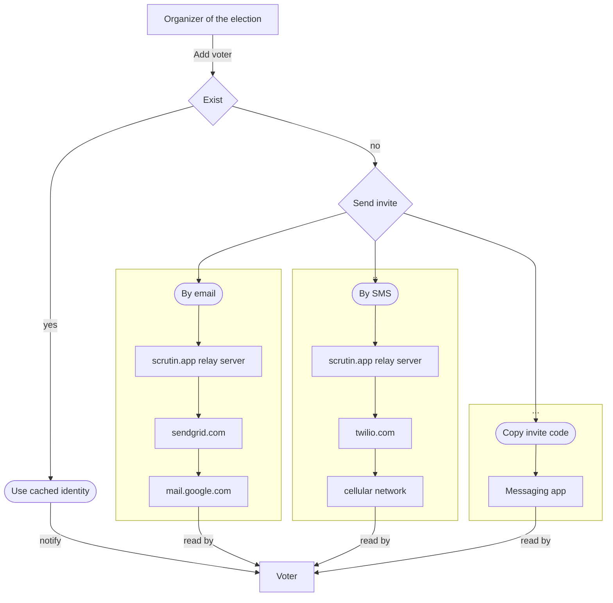
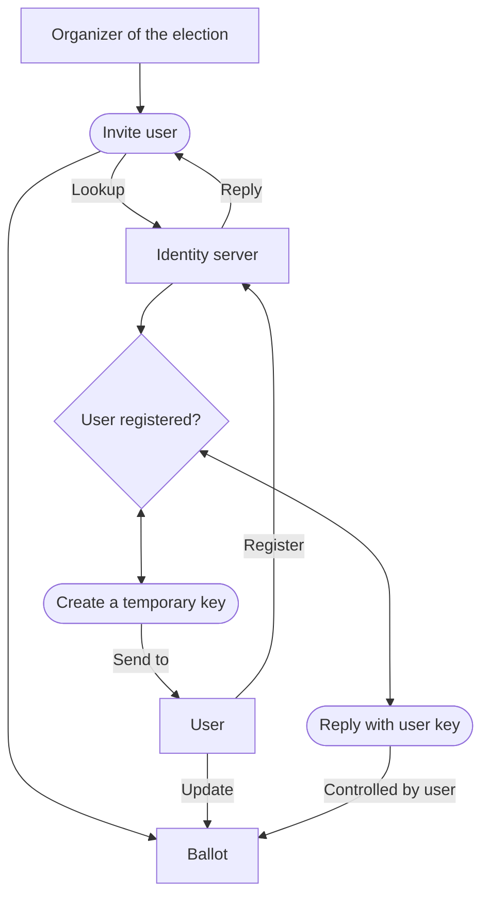

In verifiable elections, the voting list is publicly available.

We examine how voters prove their identity.

**Centralized systems** uses a cryptographic hash of the credential. When they receive credential they can verify the hash and without having to store the credential.

But observators cannot verify the voter identity without knowing the credential. They have to trust that the server manage the ballot list honestly. 

**Decentralized systems** often uses digital signatures.
A signing public key is associated to every voter.

Everyone can now verify by themselves that the ballot is emitted by the person owning the credential.
We don't even need a server at all.

##### Contact identities management

In our first approach, the organizer of the election generate the credentials and send them to voters.

If he wants, he can maintain a local database of user identities to only send credentials once.

##### First approach: Local database

##### Problem 1: Secrecy of voters' secret keys 

Here secret keys are generated on the organizer device, then sent to voters, sometimes through many intermediates.
We would prefer generating the secret keys on the voter's device and never move them.

##### Problem 2: Staying up-to-date (cache invalidation)

The problem with maintaining a local database of contacts identities is that it cannot be remotly edited.
Users will loose their secrets. Some secrets will be stolen.
We need mechanisms to deal with this.

##### Second approach: Using an identity server

We solved both problems:
- Keys are generated on the user's device and never leave
- If the user loose his secret key, he can now inform the identity server and upload a new key
